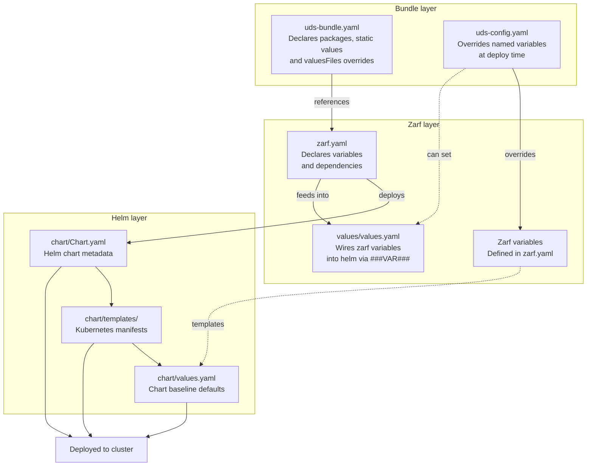

# UDS variable declaration cheat sheet

How to declare, wire, and override variables across the bundle, zarf, and helm layers.

---

## Package structure overview

```
uds-bundle.yaml          ← declares which zarf packages are in the bundle
uds-config.yaml          ← overrides bundle variables at deploy time

zarf.yaml                ← declares variables and packages dependencies
values/values.yaml       ← bridges zarf variables → helm values

chart/Chart.yaml         ← helm chart metadata
chart/values.yaml        ← helm chart baseline defaults
chart/templates/         ← kubernetes manifests (consumes .Values)
```

### Architecture diagram



### Layer responsibilities

| Layer | File | Responsibility |
|---|---|---|
| Bundle | `uds-bundle.yaml` | Declares packages, static `values` and `valuesFiles` overrides |
| Bundle | `uds-config.yaml` | Overrides named `variables` at deploy time |
| Zarf | `zarf.yaml` | Declares variables and pulls in dependencies |
| Zarf | `values/values.yaml` | Wires zarf variables into helm via `###ZARF_VAR_###` tokens |
| Helm | `chart/values.yaml` | Helm chart baseline defaults (lowest precedence) |
| Helm | `chart/templates/` | Kubernetes manifests that consume `.Values` |

### Override precedence (highest → lowest)

```
uds-config.yaml  →  zarf variable default  →  values/values.yaml  →  chart/values.yaml
```

> **Note:** `uds-config.yaml` always wins. It is the last word on any variable's value at deploy time.

---

## File-by-file reference

### `uds-bundle.yaml`

Declares which zarf packages make up your bundle. Also where you define **static overrides** (`values`, `valuesFiles`) and expose **bundle variables** that consumers can override at deploy time.

```yaml
kind: UDSBundle
metadata:
  name: my-bundle
  version: 0.0.1

packages:
  - name: my-package
    path: "path/to/pkg"
    ref: 0.0.1
    overrides:
      my-component:           # component name inside the zarf package
        my-chart:             # chart name inside that component
          valuesFiles:
            - values.yaml     # merged on top of chart/values.yaml
          values:
            - path: "replicaCount"
              value: 2        # static — fixed at bundle creation, cannot be changed at deploy
          variables:
            - name: UI_COLOR
              path: "ui.color"
              description: "Set the UI color"
              default: "purple"   # overridable at deploy time
```

> **Note:** `values` and `valuesFiles` are **fixed at bundle creation time** and cannot be changed at deploy. Only `variables` can be overridden after the bundle is created.

---

### `uds-config.yaml`

Used to override bundle `variables` at deploy time. Has a flat structure — a top-level `variables` key scoped by package name. Variable names are case-insensitive.

```yaml
variables:
  my-package:               # matches package name in uds-bundle.yaml
    UI_COLOR: green
    DB_HOST: "db.prod.internal"
    REPLICA_COUNT: 3
```

> **Note:** `uds-config.yaml` can **only** override `variables` declared in `uds-bundle.yaml`. It cannot set `values` (path/value pairs) or `valuesFiles` — those are fixed at bundle creation time.

> **Tip:** Variables can also be set without a config file, using either an environment variable prefixed with `UDS_` or the `--set` CLI flag:
> ```bash
> # Environment variable (takes precedence over uds-config.yaml)
> export UDS_UI_COLOR=green
>
> # CLI flag (highest precedence)
> uds deploy my-bundle --set ui_color=green
>
> # Scoped to a specific package
> uds deploy my-bundle --set my-package.ui_color=green
> ```

#### Variable override precedence

1. `--set` CLI flag
2. Environment variables (`UDS_*`)
3. `uds-config.yaml`
4. `default` in `uds-bundle.yaml`

---

### `zarf.yaml`

Declares variables and pulls in all images, charts, and other dependencies needed for air-gapped deployment.

```yaml
kind: ZarfPackageConfig
metadata:
  name: my-package

variables:
  - name: DB_HOST                          # declare the variable here first
    description: "Database hostname"
    default: "localhost"                   # safe fallback for standalone/local dev
    prompt: false
    sensitive: false

components:
  - name: my-component
    charts:
      - name: my-chart
        version: 1.0.0
        localPath: chart/
        valuesFiles:
          - values/values.yaml             # tell zarf to use this values file
    images:
      - myrepo/myapp:latest
```

> **Note:** Variables must be **declared here before they can be used anywhere**. If you reference `###ZARF_VAR_FOO###` in a values file without declaring `FOO` in `zarf.yaml`, substitution will silently fail — no error, just a literal unreplaced token.

> **Tip:** Always set a sensible `default` so the package can be deployed standalone without a `uds-config.yaml`.

---

### `values/values.yaml`

Bridges zarf variables into helm. Zarf performs string substitution on `###ZARF_VAR_###` tokens before passing this file to helm.

```yaml
# Zarf replaces ###ZARF_VAR_### tokens before helm ever sees this file.

config:
  database:
    host: "###ZARF_VAR_DB_HOST###"    # substituted by zarf

# No quotes for numeric/boolean values — helm expects the correct type
replicaCount: ###ZARF_VAR_REPLICA_COUNT###
autoscaling:
  enabled: ###ZARF_VAR_AUTOSCALING_ENABLED###

# Plain values that don't need to be configurable — no substitution needed
service:
  type: ClusterIP
  port: 8080
```

> **Note:** Variable names in the `###ZARF_VAR_###` token must be **uppercase**. Lowercase tokens silently fail.

> **Warning:** Do **not** quote numeric or boolean tokens. `"###ZARF_VAR_REPLICAS###"` renders as the string `"3"`, not the integer `3`, which causes helm type errors.

---

### `chart/values.yaml`

The helm chart's own baseline defaults. Lowest precedence — overridden by `values/values.yaml`, which is overridden by `uds-config.yaml`.

```yaml
# Helm chart baseline defaults.
# Never hardcode environment-specific values here.
# These should work safely in any context without modification.

config:
  database:
    host: "localhost"       # overwritten by values/values.yaml at deploy time
    port: 5432

image:
  repository: myrepo/myapp
  tag: "latest"

replicaCount: 1
```

---

### `chart/templates/`

Standard helm templates that consume `.Values`. No zarf-specific syntax here.

```yaml
# chart/templates/deployment.yaml
containers:
  - name: app
    image: "{{ .Values.image.repository }}:{{ .Values.image.tag }}"
    env:
      - name: DB_HOST
        value: "{{ .Values.config.database.host }}"
```

---

## Quick decision guide

| I want to… | Edit this file | Using this syntax |
|---|---|---|
| Add a new configurable value | `zarf.yaml` | `variables: - name: FOO` |
| Pass a zarf var into helm | `values/values.yaml` | `key: "###ZARF_VAR_FOO###"` |
| Expose a variable for deploy-time override | `uds-bundle.yaml` | `variables: - name: FOO path: "..."` |
| Set a static helm value (fixed at bundle creation) | `uds-bundle.yaml` | `values: - path: "image.tag" value: "v2"` |
| Override a variable for an environment | `uds-config.yaml` | `variables: my-package: FOO: bar` |
| Set a static chart default | `chart/values.yaml` | plain yaml, no `###VAR###` |

---

## Worked example — wiring `DB_HOST` end to end

Scenario: you want a `DB_HOST` variable that defaults to `localhost` for local dev, but gets overridden to your real database host in production.

### Step 1 — Declare the variable in `zarf.yaml`

This is the source of truth. Every other file just references or overrides what's declared here.

```yaml
kind: ZarfPackageConfig
metadata:
  name: my-package

variables:
  - name: DB_HOST                   # declare it here first
    description: "Hostname for the application database"
    default: "localhost"            # works standalone / local dev
    prompt: false

components:
  - name: my-component
    charts:
      - name: my-chart
        version: 1.0.0
        localPath: chart/
        valuesFiles:
          - values/values.yaml      # tell zarf to use this values file
```

### Step 2 — Wire it into helm via `values/values.yaml`

This file is processed by zarf before being passed to helm. The token is replaced with the current value of `DB_HOST` at deploy time.

```yaml
# This is the bridge between zarf variables and helm values.
# Zarf does string substitution here before helm ever sees the file.

config:
  database:
    host: "###ZARF_VAR_DB_HOST###"    # zarf substitutes this token
    port: 5432                        # plain value — no substitution needed
```

### Step 3 — Expose it as a bundle variable in `uds-bundle.yaml`

Declaring the variable in the overrides block makes it overridable at deploy time.

```yaml
kind: UDSBundle
metadata:
  name: my-bundle
  version: 0.0.1

packages:
  - name: my-package
    path: "path/to/pkg"
    ref: 0.0.1
    overrides:
      my-component:
        my-chart:
          variables:
            - name: DB_HOST
              path: "config.database.host"
              description: "Database hostname"
              default: "localhost"
```

### Step 4 — Consume it in `chart/values.yaml` and templates

The helm chart has its own baseline. The zarf-substituted value from step 2 overwrites it.

```yaml
# chart/values.yaml — helm baseline (lowest precedence)
config:
  database:
    host: "localhost"     # overwritten by values/values.yaml
    port: 5432
```

```yaml
# chart/templates/deployment.yaml
env:
  - name: DB_HOST
    value: "{{ .Values.config.database.host }}"
```

### Step 5 — Override for production in `uds-config.yaml`

```yaml
variables:
  my-package:               # matches package name in uds-bundle.yaml
    DB_HOST: "db.prod.internal"    # overrides the "localhost" default
```

> **Tip:** You can also override without a config file:
> ```bash
> export UDS_DB_HOST=db.prod.internal          # env var
> uds deploy my-bundle --set db_host=db.prod.internal   # CLI flag
> ```

### What the cluster sees

After zarf processes the bundle, the full substitution chain resolves to:

```yaml
env:
  - name: DB_HOST
    value: "db.prod.internal"    # uds-config won; "localhost" default never used
```

**Full chain:**
`uds-config.yaml` sets `DB_HOST=db.prod.internal` → zarf substitutes `###ZARF_VAR_DB_HOST###` in `values/values.yaml` → helm renders `.Values.config.database.host` → pod env var `DB_HOST=db.prod.internal`

---

## Common gotchas

### Variable not declared in `zarf.yaml` — substitution silently fails

If you use `###ZARF_VAR_FOO###` in a values file but never declare `FOO` under `variables:` in `zarf.yaml`, zarf will not error. It leaves the literal string `###ZARF_VAR_FOO###` in the rendered values. Helm then either errors or silently uses it as the value.

```yaml
# BAD: FOO never declared in zarf.yaml
someKey: "###ZARF_VAR_FOO###"    # renders literally, not substituted

# Fix: declare it in zarf.yaml first
variables:
  - name: FOO
    default: "fallback"
```

---

### Token must be uppercase

The `###ZARF_VAR_###` substitution token must always be uppercase, even if you declared the variable in lowercase. Mismatches silently fail.

```yaml
# WRONG: lowercase token — will NOT substitute
host: "###ZARF_VAR_db_host###"

# CORRECT
host: "###ZARF_VAR_DB_HOST###"
```

---

### `uds-config.yaml` only overrides variables — not values or valuesFiles

`uds-config.yaml` can only set `variables` declared in the `uds-bundle.yaml` overrides block. Static `values` (path/value pairs) and `valuesFiles` are fixed at bundle creation time and cannot be changed at deploy.

```yaml
# WRONG: uds-config.yaml cannot set path/value pairs
variables:
  my-package:
    image.tag: "v2.0.0"    # this is not how path overrides work

# CORRECT: path/value overrides belong in uds-bundle.yaml (fixed at bundle creation)
# uds-bundle.yaml
overrides:
  my-component:
    my-chart:
      values:
        - path: "image.tag"
          value: "v2.0.0"

# CORRECT: uds-config.yaml only sets named variables
variables:
  my-package:
    UI_COLOR: green
```

---

### uds-config override nesting must match package name exactly

The package name in `uds-config.yaml` must match the package `name` in `uds-bundle.yaml` exactly. A mismatch is silently ignored.

```yaml
# WRONG: package name doesn't match — override silently ignored
variables:
  my-app:            # doesn't match package name in uds-bundle.yaml
    UI_COLOR: green

# CORRECT: must match exactly
variables:
  my-package:        # matches name: in uds-bundle.yaml packages list
    UI_COLOR: green
```

---

### No default set — package fails when deployed without `uds-config.yaml`

If a variable has no `default:` and `prompt: false`, it will be an empty string when deployed standalone. This often causes helm to render invalid manifests without any obvious error.

```yaml
# BAD: empty string in all envs without uds-config
variables:
  - name: REPLICA_COUNT
    prompt: false

# GOOD: safe fallback that works standalone
variables:
  - name: REPLICA_COUNT
    default: "1"
    prompt: false
```

---

### Quoting numeric or boolean tokens causes helm type errors

Zarf substitution always produces strings. If helm expects an integer or boolean, wrapping the token in quotes causes a type error at render time.

```yaml
# BAD: renders as the string "3", not the integer 3
replicaCount: "###ZARF_VAR_REPLICAS###"

# GOOD: no quotes — zarf substitutes the raw value
replicaCount: ###ZARF_VAR_REPLICAS###

# Same applies to booleans
autoscaling:
  enabled: ###ZARF_VAR_AUTOSCALING_ENABLED###
```
